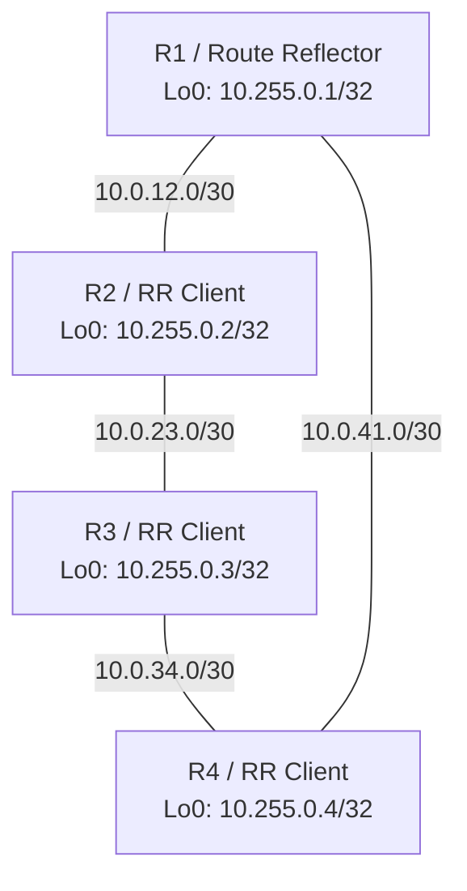

# Cisco NCS 540 Four-Router OSPF and BGP Route-Reflector Lab

This guide documents a four-router Cisco NCS 540 lab running IOS XR. It builds an OSPF underlay, establishes iBGP using loopback addresses, and uses R1 as a BGP route reflector (RR).

> **Lab warning:** Verify interface names, optic compatibility, addressing, and IOS XR command availability before applying this configuration. Use a console connection and commit changes in small stages. Do not paste the entire guide into an operational router.

## Lab objectives

- Connect four NCS 540 routers using ports 24 and 26.
- Configure `/30` point-to-point IPv4 links.
- Advertise router loopbacks through OSPF area 0.
- Use R1 as an IPv4-unicast route reflector.
- Verify routing, BGP sessions, route reflection, and link redundancy.
- Prepare the lab for later management services such as SSH, NTP, SNMPv3, syslog, and TACACS+.

## Topology

The target topology is a ring:



If the R1-R2 link has not yet been connected, the remaining links form a working chain:

```text
R1 --- R4 --- R3 --- R2
```

OSPF can still provide end-to-end reachability across the chain. Adding R1-R2 completes the ring and provides an alternate path during a single link failure.

## Cabling plan

| Link | First end | Second end |
|---|---|---|
| R1-R2 | R1 port 24 | R2 port 26 |
| R2-R3 | R2 port 24 | R3 port 26 |
| R3-R4 | R3 port 24 | R4 port 26 |
| R4-R1 | R4 port 24 | R1 port 26 |

The examples assume these IOS XR interface names:

```text
TenGigE0/0/0/24
TenGigE0/0/0/26
```

Confirm the names on every router:

```text
show interfaces brief
show ipv4 interface brief
show controllers optics
```

## IPv4 addressing plan

All physical links use the mask `255.255.255.252` (`/30`).

| Link | Router/interface | Address | Router/interface | Address |
|---|---|---:|---|---:|
| R1-R2 | R1 port 24 | `10.0.12.1/30` | R2 port 26 | `10.0.12.2/30` |
| R2-R3 | R2 port 24 | `10.0.23.1/30` | R3 port 26 | `10.0.23.2/30` |
| R3-R4 | R3 port 24 | `10.0.34.1/30` | R4 port 26 | `10.0.34.2/30` |
| R4-R1 | R4 port 24 | `10.0.41.1/30` | R1 port 26 | `10.0.41.2/30` |

| Router | Loopback0 | BGP router ID | Role |
|---|---:|---:|---|
| R1 | `10.255.0.1/32` | `10.255.0.1` | Route reflector |
| R2 | `10.255.0.2/32` | `10.255.0.2` | RR client |
| R3 | `10.255.0.3/32` | `10.255.0.3` | RR client |
| R4 | `10.255.0.4/32` | `10.255.0.4` | RR client |

## Configuration sequence

Apply the configuration in this order:

1. Hostname and Loopback0.
2. Physical interfaces and addresses.
3. Directly connected ping tests.
4. OSPF area 0.
5. Loopback reachability tests.
6. BGP on R1 and the clients.
7. Route-reflection verification.
8. Ring redundancy test.

## R1 configuration

```text
configure

hostname R1

interface Loopback0
 ipv4 address 10.255.0.1 255.255.255.255
!

interface TenGigE0/0/0/24
 description LINK-TO-R2-PORT26
 ipv4 address 10.0.12.1 255.255.255.252
 no shutdown
!

interface TenGigE0/0/0/26
 description LINK-TO-R4-PORT24
 ipv4 address 10.0.41.2 255.255.255.252
 no shutdown
!

router ospf 100
 router-id 10.255.0.1
 area 0
  interface Loopback0
   passive enable
  !
  interface TenGigE0/0/0/24
   network point-to-point
  !
  interface TenGigE0/0/0/26
   network point-to-point
  !
 !
!

router bgp 65000
 bgp router-id 10.255.0.1
 address-family ipv4 unicast
  network 10.255.0.1/32
 !
 neighbor-group RR-CLIENTS
  remote-as 65000
  update-source Loopback0
  address-family ipv4 unicast
   route-reflector-client
  !
 !
 neighbor 10.255.0.2
  use neighbor-group RR-CLIENTS
 !
 neighbor 10.255.0.3
  use neighbor-group RR-CLIENTS
 !
 neighbor 10.255.0.4
  use neighbor-group RR-CLIENTS
 !
!

commit
```

If R1-R2 is not physically connected yet, omit or leave the R1 port 24 configuration in a down state. R1 can still reach R2 through R4 and R3 after OSPF converges.

## R2 configuration

```text
configure

hostname R2

interface Loopback0
 ipv4 address 10.255.0.2 255.255.255.255
!

interface TenGigE0/0/0/24
 description LINK-TO-R3-PORT26
 ipv4 address 10.0.23.1 255.255.255.252
 no shutdown
!

interface TenGigE0/0/0/26
 description LINK-TO-R1-PORT24
 ipv4 address 10.0.12.2 255.255.255.252
 no shutdown
!

router ospf 100
 router-id 10.255.0.2
 area 0
  interface Loopback0
   passive enable
  !
  interface TenGigE0/0/0/24
   network point-to-point
  !
  interface TenGigE0/0/0/26
   network point-to-point
  !
 !
!

router bgp 65000
 bgp router-id 10.255.0.2
 address-family ipv4 unicast
  network 10.255.0.2/32
 !
 neighbor 10.255.0.1
  remote-as 65000
  update-source Loopback0
  address-family ipv4 unicast
  !
 !
!

commit
```

## R3 configuration

```text
configure

hostname R3

interface Loopback0
 ipv4 address 10.255.0.3 255.255.255.255
!

interface TenGigE0/0/0/24
 description LINK-TO-R4-PORT26
 ipv4 address 10.0.34.1 255.255.255.252
 no shutdown
!

interface TenGigE0/0/0/26
 description LINK-TO-R2-PORT24
 ipv4 address 10.0.23.2 255.255.255.252
 no shutdown
!

router ospf 100
 router-id 10.255.0.3
 area 0
  interface Loopback0
   passive enable
  !
  interface TenGigE0/0/0/24
   network point-to-point
  !
  interface TenGigE0/0/0/26
   network point-to-point
  !
 !
!

router bgp 65000
 bgp router-id 10.255.0.3
 address-family ipv4 unicast
  network 10.255.0.3/32
 !
 neighbor 10.255.0.1
  remote-as 65000
  update-source Loopback0
  address-family ipv4 unicast
  !
 !
!

commit
```

## R4 configuration

```text
configure

hostname R4

interface Loopback0
 ipv4 address 10.255.0.4 255.255.255.255
!

interface TenGigE0/0/0/24
 description LINK-TO-R1-PORT26
 ipv4 address 10.0.41.1 255.255.255.252
 no shutdown
!

interface TenGigE0/0/0/26
 description LINK-TO-R3-PORT24
 ipv4 address 10.0.34.2 255.255.255.252
 no shutdown
!

router ospf 100
 router-id 10.255.0.4
 area 0
  interface Loopback0
   passive enable
  !
  interface TenGigE0/0/0/24
   network point-to-point
  !
  interface TenGigE0/0/0/26
   network point-to-point
  !
 !
!

router bgp 65000
 bgp router-id 10.255.0.4
 address-family ipv4 unicast
  network 10.255.0.4/32
 !
 neighbor 10.255.0.1
  remote-as 65000
  update-source Loopback0
  address-family ipv4 unicast
  !
 !
!

commit
```

## Why R1 is a route reflector

Ordinary iBGP does not advertise a route learned from one iBGP neighbor to another iBGP neighbor. Without an RR, all four routers would require a full mesh of six BGP sessions.

R1 is configured with `route-reflector-client` for R2, R3, and R4. This permits R1 to reflect a route learned from one client to the other clients. Only three BGP sessions are required:

```text
R1-R2
R1-R3
R1-R4
```

The RR function does not create physical connectivity or replace OSPF. OSPF must first provide bidirectional reachability between all loopbacks.

## Direct-link verification

Examples:

```text
R2: ping 10.0.23.2 source 10.0.23.1
R3: ping 10.0.23.1 source 10.0.23.2

R3: ping 10.0.34.2 source 10.0.34.1
R4: ping 10.0.34.1 source 10.0.34.2

R4: ping 10.0.41.2 source 10.0.41.1
R1: ping 10.0.41.1 source 10.0.41.2
```

Do not mistake a ping to the router's own interface address for proof of link connectivity.

## OSPF verification

```text
show ospf neighbor
show ospf interface brief
show route ospf
show route 10.255.0.1/32
```

With the complete ring, every router should have two OSPF neighbors in `FULL` state.

With R1-R2 disconnected, the expected neighbors are:

| Router | Expected OSPF neighbors |
|---|---|
| R1 | R4 |
| R2 | R3 |
| R3 | R2 and R4 |
| R4 | R3 and R1 |

Test all loopbacks before troubleshooting BGP:

```text
ping 10.255.0.1 source 10.255.0.4
ping 10.255.0.2 source 10.255.0.1
ping 10.255.0.3 source 10.255.0.1
ping 10.255.0.4 source 10.255.0.1
```

## BGP and RR verification

On R1:

```text
show bgp ipv4 unicast summary
show bgp ipv4 unicast
show running-config router bgp
show bgp ipv4 unicast neighbors 10.255.0.2
show bgp ipv4 unicast neighbors 10.255.0.3
show bgp ipv4 unicast neighbors 10.255.0.4
```

In `show bgp ipv4 unicast summary`, a number in the `State/PfxRcd` column means the session is established. `Idle`, `Active`, or `Connect` means it is not established.

On an RR client such as R2:

```text
show bgp ipv4 unicast
show bgp ipv4 unicast 10.255.0.3/32 detail
show bgp ipv4 unicast 10.255.0.4/32 detail
```

If R2 learns R3 and R4 prefixes from neighbor `10.255.0.1` without direct R2-R3 or R2-R4 BGP sessions, route reflection is working. Detailed output may show `Originator ID` and `Cluster list` attributes.

A healthy R1 BGP table should include:

```text
*>  10.255.0.1/32  0.0.0.0
*>i 10.255.0.2/32  10.255.0.2
*>i 10.255.0.3/32  10.255.0.3
*>i 10.255.0.4/32  10.255.0.4
```

Symbols:

- `*` means valid.
- `>` means selected as the best BGP path.
- `i` before the prefix means learned through iBGP.
- `i` at the end means originated through the BGP `network` statement.

The loopbacks may still be installed in the main routing table through OSPF rather than iBGP. This is normal because the IGP is used for infrastructure reachability.

## Redundancy test

After completing the R1-R2 link, start a repeated loopback ping and shut one lab link during an approved test:

```text
ping 10.255.0.3 source 10.255.0.1 repeat 1000
```

Then temporarily shut one interface:

```text
configure
interface TenGigE0/0/0/24
 shutdown
commit
```

Check convergence:

```text
show ospf neighbor
show route 10.255.0.3/32
traceroute 10.255.0.3 source 10.255.0.1
show bgp ipv4 unicast summary
```

Restore the interface:

```text
configure
interface TenGigE0/0/0/24
 no shutdown
commit
```

## Troubleshooting checklist

### Interface remains down after `no shutdown`

```text
show interfaces brief
show interfaces TenGigE0/0/0/24
show controllers optics TenGigE0/0/0/24
show logging last 50
show alarms brief
```

Check optic type, speed, wavelength, fibre type, RX power, fibre polarity, and whether both sides use compatible transceivers.

### Direct ping succeeds but OSPF has no neighbor

- Confirm both ends use the same subnet and mask.
- Confirm both interfaces are in OSPF area 0.
- Confirm `network point-to-point` on both ends.
- Confirm the OSPF router IDs are unique.
- Check for an MTU or authentication mismatch.

```text
show ospf interface TenGigE0/0/0/24
show ospf neighbor
show logging | include OSPF
```

### BGP is Idle or Active

```text
show route 10.255.0.X/32
ping 10.255.0.X source 10.255.0.Y
show bgp ipv4 unicast summary
show bgp ipv4 unicast neighbors 10.255.0.X
show running-config router bgp
```

Confirm the neighbor exists on both routers, both use AS 65000, `update-source Loopback0` is configured, and OSPF provides return reachability.

### IOS XR terminal warning

The message below is generally caused by an unexpected control character sent by the terminal application:

```text
Invalid number(-1) sent as ASCII value to command-line process from VTY/TTY
```

If the prompt refreshes normally, it is not an OSPF or BGP failure. Confirm the current router hostname before entering commands when multiple console sessions are open.

## Useful final checks

Run on every router:

```text
show ipv4 interface brief
show ospf neighbor
show route ospf
show bgp ipv4 unicast summary
show bgp ipv4 unicast
show logging last 20
show alarms brief
```

## Recommended next stages

After the routing lab is stable:

1. Configure the dedicated management interface and `Mgmt-intf` VRF.
2. Create a local emergency administrator.
3. Enable SSHv2 and terminal timeouts.
4. Configure NTP.
5. Configure remote syslog and alarm monitoring.
6. Configure SNMPv3 for EPNM.
7. Add TACACS+/Cisco ISE with local fallback.
8. Apply management-plane hardening.
9. Continue with MPLS LDP or Segment Routing and then MP-BGP VPNv4.

## Notes

- The RR function is configured only on R1 under the client neighbors.
- R2, R3, and R4 do not use the `route-reflector-client` command.
- The physical topology and BGP topology are different: BGP uses loopback sessions carried across OSPF.
- BGP-LU (`ipv4 labeled-unicast`) and VPNv4 (`vpnv4 unicast`) are separate address families and are not part of this introductory IPv4-unicast lab.
- Use `commit confirmed` when testing changes that could affect remote management access.
